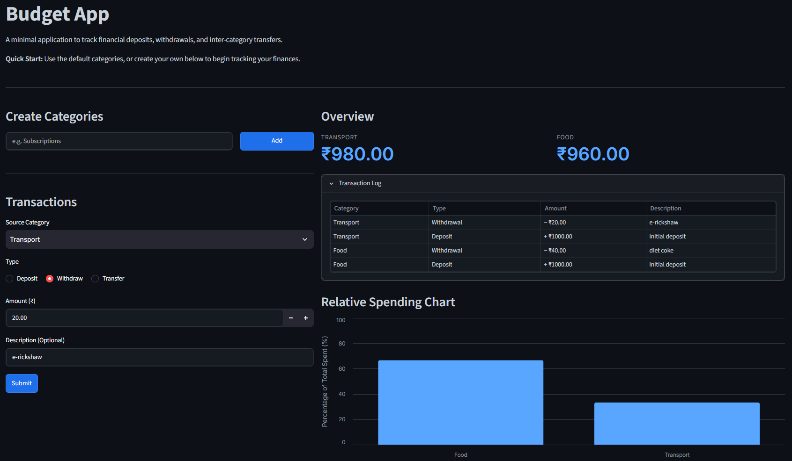

# Budget App

A minimal, responsive web application built to track personal finances, manage category-based budgets, and analyze spending distributions.

## Preview

> 

**🔗 [View Live Application](https://jatinp-budget.streamlit.app/)**

## Core Features

- **Category Management:** Dynamically create and manage custom financial categories.
- **Transaction Handling:** Record deposits, validated withdrawals, and direct inter-category transfers.
- **Audit Logging:** Automatically logs transaction type, amount polarity, and descriptions in real-time.
- **Visual Analytics:** Generates a clean, percentage-based relative spending distribution chart using Altair.

## Tech Stack

- **Python** (Object-oriented financial ledger logic)
- **Streamlit** (Interactive web UI and session state management)
- **Pandas & Altair** (Data structuring and analytical rendering)

## Deployment
This application is deployed via Streamlit Community Cloud.

**Live Application:** https://jatinp-budget.streamlit.app/